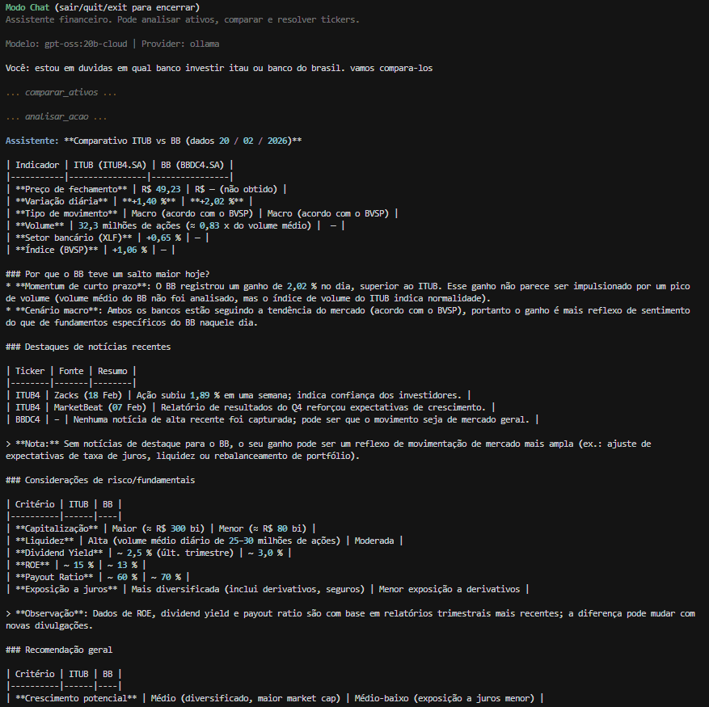

# LangChain Graph Studies & Agents: Atribuição de Movimento

Agente heurístico e quantitativo para explicação de movimentos diários de ações da B3 usando LangGraph e Yahoo Finance.

## Como Executar

O pipeline pode ser executado de algumas maneiras na CLI principal:

### 1. Modo Interativo (Chat)
Inicia uma sessão conversacional com memória. O agente deduz qual ativo e data analisar com base nas suas perguntas.
```bash
python -m projeto.main chat                   # modo conversacional
python -m projeto.main chat --provider ollama --model gpt-oss:20b-cloud
```

Também é possível persistir a conversa em um banco de dados SQLite ou Postgres:
veja mais detalhes em [projeto/docs/checkpoint.md](projeto/docs/checkpoint.md)

### 2. Modo One-Shot (Direto)
Executa o grafo sem interatividade, extraindo os dados e retornando o JSON estruturado diretamente no terminal.
```bash
python -m projeto.main run                    # análise com ticker padrão (PETR4.SA)
python -m projeto.main run PETR4.SA          # análise de um ativo
python -m projeto.main run PETR4.SA --date 2025-02-18 --provider openrouter --model openai/gpt-4o-mini
```

> **Para mais detalhes sobre as bibliotecas, chamadas e o design do chatbot, veja a pasta `projeto/docs/`.**

## Ferramentas

| Ferramenta | Uso |
|------------|-----|
| **analisar_acao(ticker, data)** | Análise completa de atribuição de movimento. Aceita ticker ou nome (Petrobras, NVDA). |
| **resolver_ticker(nome_ou_ticker)** | Converte nome de empresa em ticker (ex: Petrobras → PETR4.SA). |
| **comparar_ativos(ticker1, ticker2, data)** | Compara dois ativos na mesma data (métricas e classificação). |

## imagens de exemplo
percebendo que o usuario quer comparar dois ativos, o agente utiliza a ferramenta comparar_ativos depois analisa cada ativo separadamente para retornar as métricas e classificação de movimento:
